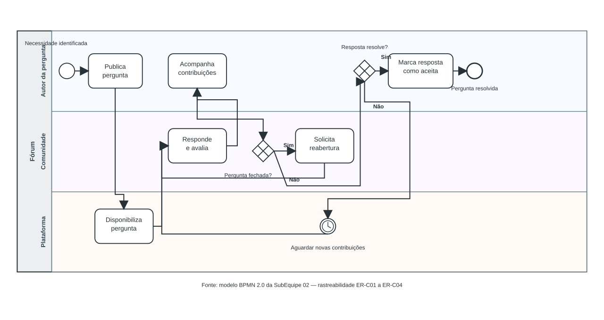

# 1.1.2. SubEquipe_02

Relatório da SubEquipe_02, estruturado nos três focos definidos pela
disciplina: Artefatos Generalistas & NFR Framework, Engenharia Reversa &
Modelagem BPMN, e IA Generativa.

## FOCO_01: Artefatos Generalistas & NFR Framework

Entrega mínima: um artefato generalista (Rich Picture ou Mapa Mental) e um
SIG na notação do NFR Framework.

### Participantes no Foco_01
| Nome do Membro |
| -- |
| _A preencher_ |

### Metodologia do Foco_01
_A preencher._

### Rich Picture ou Mapa Mental
_A preencher._

### SIG - NFR Framework
_A preencher._

## FOCO_02: Engenharia Reversa & Modelagem BPMN

Entrega mínima: um modelo, na notação BPMN, do fluxo do software encontrado
com a Engenharia Reversa.

### Participantes no Foco_02
| Nome do Membro |
| -- |
| Leonardo de Aquino |
| Cauã Nicolas |
| Luis Guilherme |

### Metodologia do Foco_02

Foi realizada uma Engenharia Reversa exploratória, predominantemente
black-box, do Stack Overflow como inspiração para o projeto `G2_ProjetoForum`.
Foram observadas páginas públicas, sem login e sem executar votos, comentários,
perguntas ou outras ações de alteração na plataforma.

A investigação ocorreu em duas rodadas complementares:

1. **Reconhecimento geral (24/08/2026):** identificação dos mecanismos de
   Comunidade e Engajamento, incluindo perguntas, respostas, comentários,
   votos, reputação, medalhas, privilégios, aceitação, incentivos e moderação.
2. **Aprofundamento focado (25/08/2026):** delimitação do fluxo de pergunta,
   resposta, avaliação e resolução, incluindo os caminhos de ausência de
   resposta, fechamento e possível reabertura.

Em cada observação foram diferenciados: comportamento visualmente observado,
regra declarada na Central de Ajuda, inferência da equipe e proposta de
adaptação para o projeto. As URLs e datas de consulta são mantidas nas fontes
de observação. O material didático da disciplina orientou a metodologia, mas
não é tratado como fonte dos comportamentos observados.

### Processo de Engenharia Reversa Aplicado

#### Escopo e critério de seleção

O escopo inicial foi o subdomínio de Comunidade e Engajamento. Após a
observação geral, os mecanismos foram comparados quanto à relevância para a
experiência central do fórum e à capacidade de formar um fluxo BPMN coerente.
O fluxo de pergunta, resposta e resolução foi selecionado como foco principal
por apresentar atores distintos, sequência de atividades, decisões e caminhos
alternativos observáveis.

| Mecanismo identificado | Papel na consolidação | Artefatos relacionados |
| --- | --- | --- |
| Publicação de pergunta | Entrada do fluxo principal | Rich Picture, BPMN |
| Resposta, comentário e votação | Colaboração e avaliação comunitária | Rich Picture, SIG/NFR, BPMN |
| Aceitação de resposta | Sinal pessoal de resolução | Rich Picture, SIG/NFR, BPMN |
| Ausência de resposta, fechamento e reabertura | Caminhos alternativos e estados de continuidade | Rich Picture, SIG/NFR, BPMN |
| Reputação, medalhas e privilégios | Contexto de reconhecimento e governança; não fazem parte do fluxo BPMN inicial | Rich Picture, SIG/NFR |
| Bounty, perfil e histórico | Mecanismos contextuais, mantidos como possibilidades futuras | Rich Picture, SIG/NFR |

Os achados da investigação geral foram refinados na rodada focada e
consolidados em cinco unidades estáveis. Os quatro primeiros formam o fluxo
principal ou seus caminhos alternativos; o quinto permanece como contexto para
os demais artefatos, sem ampliar o BPMN neste momento. As Issues e os commits
preservam a origem e a evolução de cada unidade.

#### Fluxo consolidado: pergunta, resposta e resolução

##### ER-C01 — Publicação da pergunta

- **Observação:** uma pergunta pública apresenta título, corpo textual e
  código, tags, data de criação ou modificação, visualizações, pontuação,
  comentários, respostas e ações de acompanhamento. A página pública de
  criação informa que o usuário precisa estar autenticado para perguntar.
- **Regra declarada:** a Central de Ajuda apresenta orientações para formular
  perguntas, selecionar tags, evitar perguntas inadequadas e lidar com
  perguntas sem respostas.
- **Inferência:** a autenticação é uma pré-condição da publicação, enquanto a
  pergunta publicada transforma uma necessidade individual em objeto público
  de colaboração.
- **Proposta de adaptação:** o `G2_ProjetoForum` deve explicitar campos
  obrigatórios, estado de publicação e feedback de validação, reduzindo a
  incerteza de quem pergunta.
- **Relações:** no Rich Picture, representa o autor, a plataforma e a
  comunidade; no SIG/NFR, relaciona-se a usabilidade, clareza e feedback; no
  BPMN, corresponde ao evento inicial e à tarefa de publicação.

##### ER-C02 — Recebimento e avaliação das respostas

- **Observação:** as respostas possuem autor, pontuação, controles de voto,
  comentários, ordenação e acompanhamento. Perguntas e respostas podem ser
  avaliadas pela comunidade por meio de votos.
- **Regra declarada:** a Central de Ajuda relaciona a votação à avaliação do
  conteúdo e aos efeitos de reputação. Ela descreve os votos como mecanismo de
  reconhecimento, sinalização de qualidade e participação na formação da
  liderança comunitária.
- **Inferência:** o fluxo não é uma troca direta entre autor e respondente; é
  mediado por uma comunidade que pode responder, comentar e avaliar
  simultaneamente.
- **Proposta de adaptação:** o fórum do grupo deve diferenciar visualmente
  resposta, comentário e avaliação, além de indicar se a pergunta continua
  aberta a novas contribuições.
- **Relações:** no Rich Picture, representa a interação entre autor,
  respondente e comunidade; no SIG/NFR, relaciona-se a confiança, feedback e
  transparência; no BPMN, corresponde à tarefa de responder seguida da
  avaliação comunitária.

##### ER-C03 — Aceitação como resolução pessoal

- **Observação:** uma resposta aceita é diferenciada visualmente na página da
  pergunta por um indicador próprio e permanece associada ao autor da
  pergunta.
- **Regra declarada:** a aceitação é realizada pelo autor e indica que a
  resposta funcionou para ele, sem significar necessariamente que seja
  definitiva ou perfeita. Seus efeitos de reputação são distintos dos efeitos
  dos votos comunitários.
- **Inferência:** a aceitação representa um estado de resolução pessoal dentro
  de um sistema que ainda pode permitir avaliações e novas respostas.
- **Proposta de adaptação:** o `G2_ProjetoForum` deve diferenciar claramente
  resposta aceita de resposta mais votada, evitando que a aceitação seja
  interpretada como verdade absoluta.
- **Relações:** no Rich Picture, representa a relação entre autor e
  respondente; no SIG/NFR, relaciona-se à clareza do estado e à
  previsibilidade; no BPMN, corresponde à decisão de que uma resposta resolve a
  necessidade e ao encerramento principal do fluxo.

##### ER-C04 — Caminhos alternativos e continuidade

- **Ausência de resposta:** a Central de Ajuda orienta o autor a melhorar a
  pergunta, registrar avanços e, em situações específicas, oferecer um bounty
  após determinado período. Trata-se de um estado de espera, não de um
  encerramento.
- **Ausência de aceitação:** podem existir respostas sem que o autor aceite
  alguma. A ausência do indicador de aceitação não prova que nenhuma resposta
  seja útil.
- **Fechamento:** perguntas fechadas não recebem novas respostas, mas podem ser
  editadas e encaminhadas para reabertura por revisão comunitária. Se forem
  reabertas, podem voltar a aceitar respostas.
- **Inferência:** o fluxo possui estados de espera, resolução parcial,
  bloqueio e possível recuperação, em vez de uma sequência linear obrigatória.
- **Relações:** no Rich Picture, representa colaboração, espera e moderação;
  no SIG/NFR, relaciona-se à auditabilidade e à clareza de estado; no BPMN,
  corresponde a gateways para resposta recebida, aceitação, ausência de
  resposta e fechamento ou reabertura.

Uma pergunta usada como exemplo de fechamento em 24/08/2026 estava removida e
indisponível em nova consulta em 25/08/2026. Essa mudança temporal reforça a
necessidade de registrar URL e data e impede tratar páginas dinâmicas como
evidência permanente sem contexto.

#### ER-C05 — Reconhecimento e governança comunitária

Reputação, medalhas e privilégios convertem contribuições e avaliações em
reconhecimento visível e autorização gradual para participar da governança.
Esses mecanismos são relevantes para o Rich Picture e para o SIG/NFR, pois
envolvem confiança, transparência, previsibilidade e qualidade percebida, mas
foram mantidos fora do fluxo BPMN inicial para preservar seu foco.

Bounties, perfil público e histórico também foram observados como mecanismos de
incentivo, identidade e acompanhamento. Eles permanecem como possibilidades de
aprofundamento, caso a equipe conclua que são necessários para os artefatos ou
para uma versão posterior do modelo.

#### Limitações

- Foram observadas páginas públicas, sem login e sem executar votos,
  comentários, perguntas ou outras ações na plataforma.
- As regras foram registradas a partir da Central de Ajuda e devem ser
  diferenciadas da experiência visual observada.
- O conteúdo da listagem e das perguntas é dinâmico; por isso, as observações
  relevantes possuem URL e data.
- Ainda não foram investigadas telas autenticadas, criação efetiva de
  pergunta, criação efetiva de resposta ou uso das filas de revisão.

#### Rastreabilidade da investigação

Os identificadores consolidados abaixo representam o conhecimento sintetizado no
relatório. Os identificadores eventualmente usados durante as rodadas de
investigação permanecem nos registros das Issues e nos commits correspondentes;
eles não são repetidos nos títulos do documento.

##### Issues e commits associados

| Issue | Escopo | Commits associados | Situação |
| --- | --- | --- | --- |
| [#38 — Reconhecimento geral](https://github.com/UnBArqDsw2026-2-Turma02/2026.2-T02-_G2_ProjetoForum_Entrega01/issues/38) | Investigação geral do subdomínio Comunidade e Engajamento | [035b09d — linha de base da Engenharia Reversa](https://github.com/UnBArqDsw2026-2-Turma02/2026.2-T02-_G2_ProjetoForum_Entrega01/commit/035b09dfc49811fc5bf6c4bcfda9728bb211c3ec) | Sincronizada; revisão da equipe pendente |
| [#39 — Fluxo de pergunta, resposta e resolução](https://github.com/UnBArqDsw2026-2-Turma02/2026.2-T02-_G2_ProjetoForum_Entrega01/issues/39) | Investigação focada e consolidação do fluxo candidato ao BPMN | [bbb118b — consolidação da Engenharia Reversa focada](https://github.com/UnBArqDsw2026-2-T02-_G2_ProjetoForum_Entrega01/commit/bbb118b260233d520dc9f7a212b3045ebc9197ae) | Fechada; revisão da equipe pendente |
| [#43 — Modelagem BPMN](https://github.com/UnBArqDsw2026-2-T02-_G2_ProjetoForum_Entrega01/issues/43) | Construção do modelo BPMN do fluxo de pergunta, resposta e resolução | Commit desta modelagem: a ser associado | Em elaboração; validação pendente |

| Achado consolidado | Origem nas Issues e versionamentos | Evidências principais | Artefatos relacionados |
| --- | --- | --- | --- |
| ER-C01 — Publicação da pergunta | [#38](https://github.com/UnBArqDsw2026-2-Turma02/2026.2-T02-_G2_ProjetoForum_Entrega01/issues/38), aprofundado na [#39](https://github.com/UnBArqDsw2026-2-Turma02/2026.2-T02-_G2_ProjetoForum_Entrega01/issues/39) | Página de perguntas, criação de pergunta, orientações para perguntar e pergunta pública observada | Rich Picture, SIG/NFR, BPMN |
| ER-C02 — Recebimento e avaliação das respostas | [#38](https://github.com/UnBArqDsw2026-2-Turma02/2026.2-T02-_G2_ProjetoForum_Entrega01/issues/38), aprofundado na [#39](https://github.com/UnBArqDsw2026-2-Turma02/2026.2-T02-_G2_ProjetoForum_Entrega01/issues/39) | Pergunta pública com resposta, comentários, votos e orientações sobre reputação | Rich Picture, SIG/NFR, BPMN |
| ER-C03 — Aceitação como resolução pessoal | [#38](https://github.com/UnBArqDsw2026-2-Turma02/2026.2-T02-_G2_ProjetoForum_Entrega01/issues/38), aprofundado na [#39](https://github.com/UnBArqDsw2026-2-Turma02/2026.2-T02-_G2_ProjetoForum_Entrega01/issues/39) | Resposta aceita observada e orientação oficial sobre aceitação | Rich Picture, SIG/NFR, BPMN |
| ER-C04 — Caminhos alternativos e continuidade | [#38](https://github.com/UnBArqDsw2026-2-Turma02/2026.2-T02-_G2_ProjetoForum_Entrega01/issues/38), aprofundado na [#39](https://github.com/UnBArqDsw2026-2-Turma02/2026.2-T02-_G2_ProjetoForum_Entrega01/issues/39) | Orientações sobre ausência de respostas, fechamento e reabertura; observação histórica de página dinâmica | Rich Picture, SIG/NFR, BPMN |
| ER-C05 — Reconhecimento e governança comunitária | Investigação geral registrada na [#38](https://github.com/UnBArqDsw2026-2-Turma02/2026.2-T02-_G2_ProjetoForum_Entrega01/issues/38) | Perfil público, reputação, votos, medalhas, privilégios e bounty | Rich Picture, SIG/NFR |

### Modelagem BPMN

O modelo BPMN inicial está apresentado abaixo. O arquivo-fonte editável está
disponível no [arquivo BPMN 2.0 no GitHub](https://github.com/UnBArqDsw2026-2-T02-_G2_ProjetoForum_Entrega01/blob/docs/subequipe02/docs/Base/Modelagem/BPMN/Fluxo_Pergunta_Resposta_Resolucao.bpmn).

#### Visualização do modelo

O fluxo foi organizado em um pool do fórum e três lanes: **Autor da
pergunta**, **Comunidade** e **Plataforma**. A sequência principal é:

`Necessidade identificada → Publicar pergunta → Disponibilizar pergunta → Responder e avaliar → Acompanhar contribuições → Pergunta fechada? → [Não] Resposta resolve? → [Sim] Marcar resposta como aceita → Pergunta resolvida`

O modelo também explicita dois caminhos alternativos: a espera por novas
contribuições quando ainda não há resolução e o tratamento de uma pergunta
fechada, que pode ser encaminhada para solicitação de reabertura e retorno à
colaboração. As decisões foram relacionadas aos achados ER-C01 a ER-C04 na
matriz de rastreabilidade do próprio relatório.
Mecanismos de reputação, medalhas, privilégios e bounty permanecem fora deste
primeiro BPMN por serem contextuais aos demais artefatos.

## FOCO_03: IA Generativa

Entrega mínima: pontos de vista de cada integrante sobre as lições
aprendidas e o uso da IA Generativa. Todas as pessoas integrantes devem
participar.

### Participantes no Foco_03
| Nome do Membro | Lições Aprendidas | Uso da IA Generativa (Senso Crítico) |
| -- | -- | -- |
| _A preencher_ | | |

## Versionamentos

| Nome do Membro | Contribuição | Data |
| -- | -- | -- |
| Leonardo de Aquino | Condução e consolidação da rodada inicial de Engenharia Reversa, com apoio de IA Generativa e revisão das fontes observadas. | 24/08/2026 |
| Leonardo de Aquino | Modelagem BPMN inicial do fluxo de pergunta, resposta e resolução, com pool, lanes, fluxo principal e caminhos alternativos. | 25/08/2026 |

## Referências

### Fontes de observação

- Stack Overflow. [Questions](https://stackoverflow.com/questions). Observação pública realizada em 24/08/2026.
- Stack Overflow. [Ask Question](https://stackoverflow.com/questions/ask). Observação pública realizada em 25/08/2026.
- Stack Overflow. [CLI command usage syntax for certain commands in a program](https://stackoverflow.com/questions/79997852/cli-command-usage-syntax-for-certain-commands-in-a-program). Observação pública realizada em 24/08/2026 e revisitada em 25/08/2026.
- Stack Overflow. [Perfil público observado](https://stackoverflow.com/users/32982940/itzseegy). Observação pública realizada em 24/08/2026.
- Stack Overflow. [Asking](https://stackoverflow.com/help/asking), [What does it mean when an answer is accepted?](https://stackoverflow.com/help/accepted-answer), [What should I do if no one answers my question?](https://stackoverflow.com/help/no-one-answers) e [What does it mean if a question is closed?](https://stackoverflow.com/help/closed-questions). Consultas públicas realizadas em 25/08/2026.
- Stack Overflow. [What is reputation?](https://stackoverflow.com/help/whats-reputation), [Why is voting important?](https://stackoverflow.com/help/why-vote), [Badges](https://stackoverflow.com/help/badges), [Privileges](https://stackoverflow.com/help/privileges), [What is a bounty?](https://stackoverflow.com/helpcenter/bounty) e [What are review queues?](https://stackoverflow.com/help/reviews-intro). Consultas públicas realizadas em 24/08/2026.

A pergunta usada como exemplo de fechamento em 24/08/2026 foi registrada como
observação histórica: [Why is math.sqrt returning ValueError?](https://stackoverflow.com/questions/79997883/why-is-math-sqrt-returning-value-error). A URL estava indisponível na nova consulta de 25/08/2026, reforçando a limitação de evidências em páginas dinâmicas.

### Referência metodológica

- SERRANO, Milene. *Engenharia reversa*. Material didático em PDF da disciplina Arquitetura e Desenho de Software. Universidade de Brasília, 2026.2. Disponibilizado no ambiente Aprender3, com acesso restrito aos alunos da disciplina.

## Histórico de Versão

| Versão | Data | Descrição | Autor(es) | Data de revisão | Revisor(es) |
| :-: | :-: | :-: | :-: | :-: | :-: |
| `1.0` | 22/08/2026 | Estruturação inicial do relatório. | [Alberto Cavalcante](https://github.com/oalbertocavalcante) | - | - |
| `1.1` | 24/08/2026 | Inclusão da metodologia, dos achados iniciais da Engenharia Reversa geral de Comunidade e Engajamento e organização das referências entre fontes de observação e referência metodológica. | Leonardo de Aquino | - | Revisão da SubEquipe_02 pendente |
| `1.2` | 25/08/2026 | Consolidação dos achados da Engenharia Reversa geral e focada, com identificadores estáveis e rastreabilidade organizada por Issues e commits. | Leonardo de Aquino | - | Revisão da SubEquipe_02 pendente |
| `1.3` | 25/08/2026 | Inclusão do artefato BPMN inicial do fluxo de pergunta, resposta e resolução, com arquivo-fonte versionável, escopo, decisões e rastreabilidade aos achados ER-C01 a ER-C04. | Leonardo de Aquino | - | Validação do artefato pendente |
