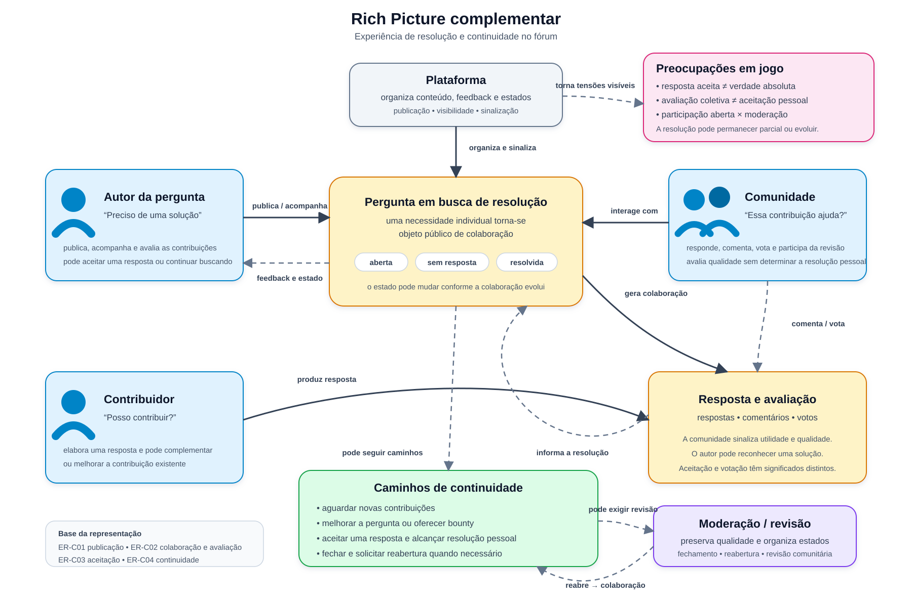
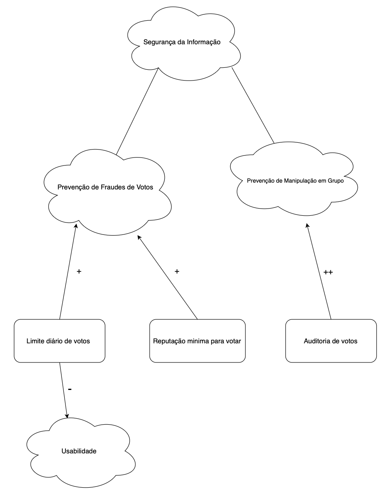
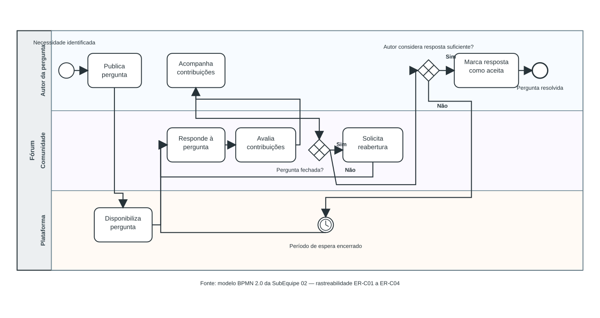

# 1.1.2. SubEquipe_02

Relatório da SubEquipe_02, estruturado nos três focos definidos pela
disciplina: Artefatos Generalistas & NFR Framework, Engenharia Reversa &
Modelagem BPMN, e IA Generativa.

## FOCO_01: Artefatos Generalistas & NFR Framework

Entrega mínima: um artefato generalista (Rich Picture ou Mapa Mental) e um
SIG na notação do NFR Framework.

### Participantes no Foco_01
| Nome do Membro |
| --- |
| Cauã Oliveira |
| Luis Guilherme |
| Leonardo de Aquino |

### Metodologia do Foco_01
A metodologia do Foco_01 combinou a elaboração de Rich Pictures complementares e a aplicação do NFR Framework, tendo como insumo os achados da [Engenharia Reversa do Stack Overflow (Foco_02)](#processo-de-engenharia-reversa-aplicado). O trabalho foi organizado por responsabilidades principais — Rich Pictures, SIG/NFR e consolidação — seguido de revisão e integração do relatório.

Os Rich Pictures foram utilizados como modelagens visuais e pouco formais, com desenhos e textos curtos para representar perspectivas complementares de atores, objetivos, interações, relações e preocupações do subdomínio de Comunidade e Engajamento do `G2_ProjetoForum`. O SIG/NFR foi utilizado para organizar o requisito não funcional de Segurança da Informação, seus subobjetivos, operacionalizações, contribuições e trade-offs. Em ambos os tipos de artefato, as observações do sistema de referência foram separadas das decisões de adaptação para o fórum proposto.

### Rich Pictures complementares — subdomínio Comunidade e Engajamento

O Foco_01 apresenta duas representações complementares do subdomínio. A primeira enfatiza o ecossistema social, o reconhecimento e a governança comunitária. A segunda concentra-se na experiência de resolução e nos caminhos de continuidade da pergunta. A divisão evita repetir a mesma perspectiva e permite relacionar os achados da Engenharia Reversa aos diferentes níveis de compreensão do problema.

| Representação | Ênfase | Achados priorizados |
| --- | --- | --- |
| Rich Picture — ecossistema social, reconhecimento e governança | Atores, relações, reputação, medalhas, privilégios, recompensas e moderação | ER-C01 a ER-C05, com ênfase em ER-C02 e ER-C05 |
| Rich Picture complementar — experiência de resolução e continuidade | Necessidade do autor, colaboração, aceitação, estados de espera, fechamento e reabertura | ER-C01 a ER-C04 |

#### Rich Picture — ecossistema social, reconhecimento e governança

Rich picture do subdomínio **Comunidade e Engajamento** do **G2_ProjetoForum**. Este
diagrama não representa o Stack Overflow: representa o fórum que o grupo
está construindo, tendo a
[engenharia reversa do Foco_02](#processo-de-engenharia-reversa-aplicado)
como insumo de pesquisa e ponto de partida para as decisões de escopo e
design.

#### Diagrama

<b>Figura 1</b> — Rich Picture do subdomínio 02 Comunidade e Engajamento do G2_ProjetoForum. 
<b>Autor:</b> Cauã Oliveira

#### O que está representado
O Rich Picture representa o subdomínio de Comunidade e Engajamento do
`G2_ProjetoForum`, inspirado em mecanismos observados no Stack Overflow. Ele
destaca os principais atores, elementos e relações envolvidos na produção,
avaliação e reconhecimento das contribuições da comunidade. O diagrama
evidencia como uma dúvida publicada no fórum pode gerar respostas, ser avaliada
pelos usuários por meio de votos e contribuir para a construção da reputação,
das medalhas e dos privilégios dos participantes.

#### Estrutura do G2_ProjetoForum
Os elementos estruturais representam os mecanismos que sustentam as interações entre os usuários e permanecem como parte do funcionamento contínuo da plataforma:

- **Plataforma**: é o ambiente que conecta os diferentes participantes e permite a realização das interações. Ela intermedeia o relacionamento entre o autor da pergunta, os contribuidores e a comunidade, além de disponibilizar os mecanismos de perguntas, respostas, votos e reconhecimento.
- **Reputação (score)**: é a estrutura de reconhecimento construída a partir das contribuições e dos votos recebidos. Ela funciona como um indicador da participação e da confiança conquistada pelo usuário dentro da comunidade.
- **Privilégios**: representam a progressão de capacidades concedidas aos usuários conforme sua reputação e confiança aumentam. Esse mecanismo permite distribuir gradualmente responsabilidades dentro da comunidade.
- **Medalhas**: representam marcos de reconhecimento das contribuições dos usuários. Funcionam como uma forma de reconhecimento social e tornam visível a participação e as conquistas alcançadas na plataforma.
- **Votos**: constituem o principal mecanismo de avaliação coletiva representado no Rich Picture. Por meio deles, a comunidade sinaliza a qualidade ou utilidade de perguntas e respostas, influenciando diretamente a construção da reputação dos participantes.
- **Moderação comunitária**: representa a estrutura de governança descentralizada sustentada pelos privilégios concedidos aos usuários que conquistam maior confiança. Dessa forma, parte da responsabilidade pela qualidade da comunidade é distribuída entre seus próprios participantes.

#### Atores e seus papéis
- **Autor da Pergunta:** inicia a interação ao apresentar uma dúvida ou problema à comunidade. Sua necessidade é representada pela preocupação “Preciso de ajuda”.
- **Contribuidor**: representa o usuário que participa ativamente da construção do conhecimento, principalmente por meio da elaboração de respostas. Sua preocupação é expressa por “Posso responder”.
- **Comunidade**: representa os demais participantes que interagem com o conteúdo, avaliam respostas e contribuem para a identificação das melhores soluções. A preocupação “Essa resposta ajuda” representa a perspectiva de avaliação coletiva da utilidade do conteúdo.
- **Plataforma**: representa o ambiente que conecta os participantes e disponibiliza os mecanismos necessários para perguntas, respostas, votos, reputação, privilégios e demais interações.
- **Moderação comunitária**: representa a capacidade de usuários confiáveis participarem da manutenção e organização da comunidade, reduzindo a dependência de uma moderação exclusivamente centralizada.

#### Fluxo de contribuição e avaliação
O ciclo representado no Rich Picture descreve como uma necessidade individual pode se transformar em uma contribuição reconhecida pela comunidade:

1. **Publicação da pergunta**: o Autor da Pergunta possui uma necessidade e publica uma dúvida na plataforma, iniciando o ciclo de interação.
2. **Produção da resposta**: o Contribuidor identifica a pergunta e pode elaborar uma resposta com o objetivo de solucionar o problema apresentado.
3. **Avaliação da comunidade**: a Comunidade interage com a resposta e avalia sua utilidade por meio dos mecanismos de votação. A própria pergunta também pode ser avaliada pela comunidade, conforme indicado pela relação tracejada “Avaliar a pergunta”.
4. **Construção da reputação**: os votos recebidos pelas contribuições influenciam a Reputação (score) do usuário, permitindo que sua participação seja reconhecida pela comunidade.
5. **Reconhecimento e progressão**: conforme o usuário acumula reputação e realiza contribuições relevantes, pode conquistar Medalhas e obter novos Privilégios dentro da plataforma.
6. **Participação na moderação**: os privilégios conquistados permitem que usuários com maior nível de confiança participem mais ativamente da Moderação comunitária, contribuindo para a manutenção da qualidade do conteúdo.
7. **Retroalimentação do ciclo**: a participação, o reconhecimento e a possibilidade de obter novos privilégios incentivam a continuidade das contribuições, fortalecendo o engajamento e a própria comunidade.

**Reputação, medalhas e privilégios**

A Reputação constitui um dos elementos centrais do Rich Picture, pois representa a forma como a participação e as contribuições dos usuários são reconhecidas pela comunidade.

A partir desse mecanismo, o usuário pode conquistar Medalhas, que representam marcos de contribuição e reconhecimento, e obter Privilégios, que ampliam progressivamente sua capacidade de atuação dentro da plataforma.

Assim, o diagrama representa a relação:

**Contribuição → Votos → Reputação → Medalhas e Privilégios.**

Esse mecanismo materializa a ideia de meritocracia técnica, na qual o reconhecimento e a confiança são construídos progressivamente a partir da participação do usuário na comunidade.

**Recompensas e engajamento**

O Rich Picture também representa as Recompensas como um mecanismo complementar de incentivo à participação. Elas permitem que o autor de uma pergunta ofereça uma recompensa para estimular outros usuários a contribuírem com uma resposta.

Enquanto a reputação e as medalhas representam principalmente formas de reconhecimento social dentro da comunidade, as recompensas funcionam como um incentivo adicional para estimular a produção de respostas.

**Moderação comunitária**

A relação entre Privilégios e Moderação comunitária representa a descentralização progressiva da governança da plataforma.

À medida que os usuários constroem reputação e conquistam confiança, determinados privilégios são disponibilizados, permitindo que participantes experientes contribuam para a manutenção da qualidade e organização da comunidade.

Dessa forma, a moderação não depende exclusivamente de uma autoridade central: parte da responsabilidade é distribuída entre os próprios membros da comunidade, contribuindo para uma operação mais escalável e sustentável.

#### Preocupações do subdomínio
O Rich Picture também evidencia algumas preocupações presentes nas interações:

- **Autor da pergunta**: busca obter ajuda e solucionar seu problema.
- **Contribuidor**: busca participar e oferecer uma solução útil.
- **Comunidade**: procura identificar e valorizar respostas que realmente contribuam para a resolução dos problemas.
- **Plataforma**: precisa organizar essas interações por meio de mecanismos de votação, reputação e privilégios.
- **Moderação comunitária**: precisa preservar a qualidade e o funcionamento da comunidade à medida que o volume de contribuições cresce.

#### Relação com os achados da Engenharia Reversa

O Rich Picture do ecossistema social foi elaborado a partir da investigação geral registrada na
[Issue #38](https://github.com/UnBArqDsw2026-2-Turma02/2026.2-T02-_G2_ProjetoForum_Entrega01/issues/38), consolidada no
[commit 035b09d](https://github.com/UnBArqDsw2026-2-Turma02/2026.2-T02-_G2_ProjetoForum_Entrega01/commit/035b09dfc49811fc5bf6c4bcfda9728bb211c3ec), e do aprofundamento do fluxo de pergunta, resposta e resolução registrado na
[Issue #39](https://github.com/UnBArqDsw2026-2-Turma02/2026.2-T02-_G2_ProjetoForum_Entrega01/issues/39), consolidado no
[commit bbb118b](https://github.com/UnBArqDsw2026-2-Turma02/2026.2-T02-_G2_ProjetoForum_Entrega01/commit/bbb118b260233d520dc9f7a212b3045ebc9197ae).

| Elementos do Rich Picture | Achados relacionados | Relação com o artefato |
| --- | --- | --- |
| Autor da pergunta, pergunta e preocupação “Preciso de ajuda” | ER-C01 — Publicação da pergunta | Representam a necessidade inicial e a entrada da interação comunitária. |
| Contribuidor, resposta, comunidade e votos | ER-C02 — Recebimento e avaliação das respostas | Representam a colaboração e a avaliação coletiva das contribuições. |
| Aceitação e resolução da resposta | ER-C03 — Aceitação como resolução pessoal | Não aparecem como símbolos específicos neste artefato; esse detalhe permanece aprofundado no Rich Picture complementar e no BPMN. |
| Recompensas e continuidade da participação | ER-C04 — Caminhos alternativos e continuidade | Representam mecanismos de incentivo e a possibilidade de continuidade das contribuições, sem reproduzir o fluxo processual detalhado. |
| Reputação, medalhas, privilégios e moderação comunitária | ER-C05 — Reconhecimento e governança comunitária | Representam reconhecimento, progressão de confiança e participação na governança da comunidade. |

Essa matriz delimita o papel deste Rich Picture: ele sintetiza atores, relações,
preocupações e mecanismos sociais, sem substituir o detalhamento processual do
BPMN nem afirmar que todos os caminhos da Engenharia Reversa estão desenhados
como etapas visuais.

#### Rastreabilidade do Rich Picture

| Issue | Commits associados | Contribuição registrada |
| --- | --- | --- |
| [#46 — Registro do Rich Picture](https://github.com/UnBArqDsw2026-2-Turma02/2026.2-T02-_G2_ProjetoForum_Entrega01/issues/46) | [a3947b5 — inclusão do Rich Picture](https://github.com/UnBArqDsw2026-2-Turma02/2026.2-T02-_G2_ProjetoForum_Entrega01/commit/a3947b5d2a94298c01bf3d29941d77c591ca7342); [51d9cfe — referências, IA e versionamentos](https://github.com/UnBArqDsw2026-2-Turma02/2026.2-T02-_G2_ProjetoForum_Entrega01/commit/51d9cfe84d66d1360fd7e7bde0737f90facef77d) | Inclusão do artefato, referências, registro do uso de IA e versionamento inicial. |
| [#47 — Revisão e adequação do Rich Picture](https://github.com/UnBArqDsw2026-2-Turma02/2026.2-T02-_G2_ProjetoForum_Entrega01/issues/47) | [f9594db — revisão e rastreabilidade](https://github.com/UnBArqDsw2026-2-Turma02/2026.2-T02-_G2_ProjetoForum_Entrega01/commit/f9594dbf8326fe17fd4681103d9ba1ce765c02c7) | Revisão do artefato e consolidação de sua rastreabilidade com a Engenharia Reversa. |
| [#50 — Integração e ajustes finais](https://github.com/UnBArqDsw2026-2-Turma02/2026.2-T02-_G2_ProjetoForum_Entrega01/issues/50) | [c71b9dd — integração do Rich Picture](https://github.com/UnBArqDsw2026-2-Turma02/2026.2-T02-_G2_ProjetoForum_Entrega01/commit/c71b9ddd2a961072f375450d7308d3ed1e0295a4) | Integração do artefato ao relatório consolidado da SubEquipe 02. |

#### Rich Picture complementar — experiência de resolução e continuidade

Este Rich Picture representa a perspectiva da experiência de resolução de uma pergunta, sem substituir o detalhamento processual do BPMN. Seu foco está nas relações entre a necessidade do autor, a colaboração da comunidade, os mecanismos de avaliação e os estados de continuidade que podem surgir quando a pergunta ainda não foi resolvida.

##### Diagrama

<b>Figura 2</b> — Rich Picture complementar da experiência de resolução e continuidade no G2_ProjetoForum. 
<b>Autor:</b> Leonardo de Aquino

##### O que está representado

- **Perspectiva do usuário:** a necessidade individual do autor torna-se uma pergunta pública, cujo estado pode evoluir conforme surgem contribuições.
- **Colaboração e avaliação:** contribuidores e comunidade respondem, comentam, votam e participam da avaliação da utilidade do conteúdo.
- **Resolução pessoal:** a aceitação de uma resposta é representada como reconhecimento do autor e não como prova de verdade absoluta ou substituto da avaliação coletiva.
- **Continuidade:** a pergunta pode permanecer em espera, ser melhorada, receber incentivo, ser fechada ou encaminhada para reabertura, sem que esses caminhos sejam obrigatoriamente lineares.
- **Preocupações:** o artefato explicita as tensões entre abertura à colaboração, qualidade percebida, resolução pessoal e moderação comunitária.

##### Relação com os achados da Engenharia Reversa

| Elementos do Rich Picture complementar | Achados relacionados | Relação com o artefato |
| --- | --- | --- |
| Autor, necessidade e pergunta pública | ER-C01 — Publicação da pergunta | Representam a origem da interação e a transformação da necessidade em objeto de colaboração. |
| Contribuidor, comunidade, resposta e avaliação | ER-C02 — Recebimento e avaliação das respostas | Representam a colaboração mediada pela comunidade e a distinção entre resposta, comentário e voto. |
| Aceitação pessoal e resolução | ER-C03 — Aceitação como resolução pessoal | Evidenciam que a resposta aceita possui significado próprio para o autor e não equivale necessariamente à mais votada. |
| Espera, melhoria, bounty, fechamento e reabertura | ER-C04 — Caminhos alternativos e continuidade | Representam estados e possibilidades de continuidade sem reproduzir a notação processual do BPMN. |

##### Rastreabilidade do Rich Picture complementar

| Issue | Commit associado | Contribuição registrada |
| --- | --- | --- |
| [#69 — Elaboração de Rich Picture complementar baseado na Engenharia Reversa](https://github.com/UnBArqDsw2026-2-T02-_G2_ProjetoForum_Entrega01/issues/69) | A ser associado após a consolidação do artefato | Elaboração do Rich Picture complementar sobre experiência de resolução e continuidade. |

### SIG - NFR Framework
#### Escolha e delimitação do requisito não funcional

Com base na análise do Stack Overflow, foi escolhido o critério de qualidade
**Segurança da Informação**, delimitado ao problema de **abuso da reputação
por meio de votos**. A delimitação é relevante para o `G2_ProjetoForum`: a
reputação deve refletir contribuições confiáveis, sem impedir a participação
legítima da comunidade.

Essa decisão deriva principalmente dos achados `ER-C02` e `ER-C05`. O
`ER-C02`, consolidado nas [Issues #38](https://github.com/UnBArqDsw2026-2-Turma02/2026.2-T02-_G2_ProjetoForum_Entrega01/issues/38)
e [#39](https://github.com/UnBArqDsw2026-2-Turma02/2026.2-T02-_G2_ProjetoForum_Entrega01/issues/39),
registra que votos avaliam perguntas e respostas e produzem efeitos de
reputação; o `ER-C05`, registrado na [Issue #38](https://github.com/UnBArqDsw2026-2-Turma02/2026.2-T02-_G2_ProjetoForum_Entrega01/issues/38),
registra reputação, reconhecimento e governança como mecanismos de confiança
da comunidade. As regras observadas foram confrontadas com as orientações
oficiais sobre [reputação](https://stackoverflow.com/help/whats-reputation) e
[importância da votação](https://stackoverflow.com/help/why-vote).

As operacionalizações apresentadas a seguir são **propostas de adaptação para
o `G2_ProjetoForum`**, e não afirmações de que o Stack Overflow implemente
exatamente essas três regras. Essa distinção mantém separadas a observação do
software de referência e a decisão de projeto do grupo.

#### Diagrama SIG

No diagrama, as nuvens representam softgoals e os retângulos representam
operacionalizações. A decomposição do softgoal principal em **Prevenção de
Fraudes de Votos** e **Prevenção de Manipulação em Grupo** é interpretada como
uma relação `AND`: os dois subobjetivos devem ser considerados para tratar o
problema delimitado. As contribuições das operacionalizações são indicadas
pelos rótulos `+`, `-` e `++`.

#### Rastreabilidade, operacionalizações e trade-offs

| Elemento do SIG | Tipo e decisão | Rastreabilidade e efeito esperado |
| --- | --- | --- |
| Segurança da Informação | Softgoal principal | `ER-C02` e `ER-C05`: votos, reputação e governança sustentam a confiança no fórum. |
| Prevenção de Fraudes de Votos | Subobjetivo | `ER-C02`: reduz a possibilidade de que contas falsas ou comportamentos abusivos distorçam a avaliação comunitária. |
| Prevenção de Manipulação em Grupo | Subobjetivo | `ER-C05`: protege a reputação e a governança contra trocas coordenadas de votos. |
| Limite diário de votos | Operacionalização com `+ HELP` e `- HURT` | Ajuda a reduzir abuso de votos, mas pode prejudicar a participação de usuários legítimos e engajados. |
| Reputação mínima para votar | Operacionalização com `+ HELP` | Dificulta o uso imediato de contas falsas para influenciar a pontuação. |
| Auditoria de votos | Operacionalização com `++ MAKE` | Contribui fortemente para identificar e tratar padrões de manipulação coordenada. |

O principal trade-off explicitado é entre **segurança** e **usabilidade**: um
limite de votos pode reduzir fraudes, mas também criar fricção para usuários
legítimos. Por isso, a solução do grupo deve combinar controles preventivos
com feedback claro, revisão de casos suspeitos e possibilidade de correção,
evitando transformar o mecanismo de proteção em uma barreira opaca.

No vocabulário utilizado no SIG, `HELP` indica contribuição positiva parcial,
`HURT` indica contribuição negativa e `MAKE` indica contribuição positiva
forte. A legenda textual explicita a interpretação das relações para que os
símbolos do diagrama não sejam confundidos com regras observadas diretamente
na plataforma de referência.

#### Rastreabilidade do SIG/NFR

| Issue | Commit associado | Contribuição registrada |
| --- | --- | --- |
| [#48 — Registro do SIG/NFR](https://github.com/UnBArqDsw2026-2-Turma02/2026.2-T02-_G2_ProjetoForum_Entrega01/issues/48) | [e5ff0a5 — diagrama SIG e framework NFR](https://github.com/UnBArqDsw2026-2-Turma02/2026.2-T02-_G2_ProjetoForum_Entrega01/commit/e5ff0a518c6eee6b3df4cf4518ecf4db917ac1eb) | Criação do diagrama SIG e organização inicial do requisito não funcional. |
| [#49 — Revisão e adequação do SIG/NFR](https://github.com/UnBArqDsw2026-2-Turma02/2026.2-T02-_G2_ProjetoForum_Entrega01/issues/49) | [90398ff — revisão e rastreabilidade](https://github.com/UnBArqDsw2026-2-Turma02/2026.2-T02-_G2_ProjetoForum_Entrega01/commit/90398ff268cb99b59d7436dfc93fad10b3c925dc) | Revisão do diagrama, dos trade-offs e da rastreabilidade com os achados da Engenharia Reversa. |
| [#50 — Integração e ajustes finais](https://github.com/UnBArqDsw2026-2-Turma02/2026.2-T02-_G2_ProjetoForum_Entrega01/issues/50) | [c71b9dd — integração da SubEquipe 02](https://github.com/UnBArqDsw2026-2-Turma02/2026.2-T02-_G2_ProjetoForum_Entrega01/commit/c71b9ddd2a961072f375450d7308d3ed1e0295a4) | Preservação do SIG/NFR na versão integrada do relatório. |

## FOCO_02: Engenharia Reversa & Modelagem BPMN

Entrega mínima: um modelo, na notação BPMN, do fluxo do software encontrado
com a Engenharia Reversa.

### Participantes no Foco_02
| Nome do Membro |
| -- |
| Leonardo de Aquino |

### Metodologia do Foco_02

Foi realizada uma Engenharia Reversa exploratória, predominantemente
black-box, do Stack Overflow como inspiração para o projeto `G2_ProjetoForum`.
Foram observadas páginas públicas, sem login e sem executar votos, comentários,
perguntas ou outras ações de alteração na plataforma.

A investigação ocorreu em duas rodadas complementares:

1. **Reconhecimento geral (24/08/2026):** identificação dos mecanismos de
   Comunidade e Engajamento, incluindo perguntas, respostas, comentários,
   votos, reputação, medalhas, privilégios, aceitação, incentivos e moderação.
2. **Aprofundamento focado (25/08/2026):** delimitação do fluxo de pergunta,
   resposta, avaliação e resolução, incluindo os caminhos de ausência de
   resposta, fechamento e possível reabertura.

Em cada observação foram diferenciados: comportamento visualmente observado,
regra declarada na Central de Ajuda, inferência da equipe e proposta de
adaptação para o projeto. As URLs e datas de consulta são mantidas nas fontes
de observação. O material didático da disciplina orientou a metodologia, mas
não é tratado como fonte dos comportamentos observados.

Foram utilizadas ferramentas distintas para observar e consolidar os
resultados: um navegador web para a inspeção black-box das páginas públicas;
GitHub Issues e commits para registrar os achados e manter a rastreabilidade;
e Markdown com Docsify para organizar e apresentar o relatório.

### Processo de Engenharia Reversa Aplicado

#### Escopo e critério de seleção

O escopo inicial foi o subdomínio de Comunidade e Engajamento. Após a
observação geral, os mecanismos foram comparados quanto à relevância para a
experiência central do fórum e à capacidade de formar um fluxo BPMN coerente.
O fluxo de pergunta, resposta e resolução foi selecionado como foco principal
por apresentar atores distintos, sequência de atividades, decisões e caminhos
alternativos observáveis.

| Mecanismo identificado | Papel na consolidação | Artefatos relacionados |
| --- | --- | --- |
| Publicação de pergunta | Entrada do fluxo principal | Rich Picture, BPMN |
| Resposta, comentário e votação | Colaboração e avaliação comunitária | Rich Picture, SIG/NFR, BPMN |
| Aceitação de resposta | Sinal pessoal de resolução | Rich Picture, SIG/NFR, BPMN |
| Ausência de resposta, fechamento e reabertura | Caminhos alternativos e estados de continuidade | Rich Picture, SIG/NFR, BPMN |
| Reputação, medalhas e privilégios | Contexto de reconhecimento e governança; não fazem parte do fluxo BPMN inicial | Rich Picture, SIG/NFR |
| Bounty, perfil e histórico | Mecanismos contextuais, mantidos como possibilidades futuras | Rich Picture, SIG/NFR |

Os achados da investigação geral foram refinados na rodada focada e
consolidados em cinco unidades estáveis. Os quatro primeiros formam o fluxo
principal ou seus caminhos alternativos; o quinto permanece como contexto para
os demais artefatos, sem ampliar o BPMN neste momento. As Issues e os commits
preservam a origem e a evolução de cada unidade.

#### Fluxo consolidado: pergunta, resposta e resolução

##### ER-C01 — Publicação da pergunta

- **Observação:** uma pergunta pública apresenta título, corpo textual e
  código, tags, data de criação ou modificação, visualizações, pontuação,
  comentários, respostas e ações de acompanhamento. A página pública de
  criação informa que o usuário precisa estar autenticado para perguntar.
- **Regra declarada:** a Central de Ajuda apresenta orientações para formular
  perguntas, selecionar tags, evitar perguntas inadequadas e lidar com
  perguntas sem respostas.
- **Inferência:** a autenticação é uma pré-condição da publicação, enquanto a
  pergunta publicada transforma uma necessidade individual em objeto público
  de colaboração.
- **Proposta de adaptação:** o `G2_ProjetoForum` deve explicitar campos
  obrigatórios, estado de publicação e feedback de validação, reduzindo a
  incerteza de quem pergunta.
- **Relações:** nos Rich Pictures, representa o autor, a plataforma e a
  comunidade; no SIG/NFR, relaciona-se a usabilidade, clareza e feedback; no
  BPMN, corresponde ao evento inicial e à tarefa de publicação.

##### ER-C02 — Recebimento e avaliação das respostas

- **Observação:** as respostas possuem autor, pontuação, controles de voto,
  comentários, ordenação e acompanhamento. Perguntas e respostas podem ser
  avaliadas pela comunidade por meio de votos.
- **Regra declarada:** a Central de Ajuda relaciona a votação à avaliação do
  conteúdo e aos efeitos de reputação. Ela descreve os votos como mecanismo de
  reconhecimento, sinalização de qualidade e participação na formação da
  liderança comunitária.
- **Inferência:** o fluxo não é uma troca direta entre autor e respondente; é
  mediado por uma comunidade que pode responder, comentar e avaliar
  simultaneamente.
- **Proposta de adaptação:** o fórum do grupo deve diferenciar visualmente
  resposta, comentário e avaliação, além de indicar se a pergunta continua
  aberta a novas contribuições.
- **Relações:** nos Rich Pictures, representa a interação entre autor,
  respondente e comunidade; no SIG/NFR, relaciona-se a confiança, feedback e
  transparência; no BPMN, corresponde à tarefa de responder seguida da
  avaliação comunitária.

##### ER-C03 — Aceitação como resolução pessoal

- **Observação:** uma resposta aceita é diferenciada visualmente na página da
  pergunta por um indicador próprio e permanece associada ao autor da
  pergunta.
- **Regra declarada:** a aceitação é realizada pelo autor e indica que a
  resposta funcionou para ele, sem significar necessariamente que seja
  definitiva ou perfeita. Seus efeitos de reputação são distintos dos efeitos
  dos votos comunitários.
- **Inferência:** a aceitação representa um estado de resolução pessoal dentro
  de um sistema que ainda pode permitir avaliações e novas respostas.
- **Proposta de adaptação:** o `G2_ProjetoForum` deve diferenciar claramente
  resposta aceita de resposta mais votada, evitando que a aceitação seja
  interpretada como verdade absoluta.
- **Relações:** no Rich Picture complementar, representa a relação entre autor
  e respondente; no Rich Picture do ecossistema social, a aceitação permanece
  como aspecto contextual. No SIG/NFR, relaciona-se à clareza do estado e à
  previsibilidade; no BPMN, corresponde à decisão de que uma resposta resolve a
  necessidade e ao encerramento principal do fluxo.

##### ER-C04 — Caminhos alternativos e continuidade

- **Ausência de resposta:** a Central de Ajuda orienta o autor a melhorar a
  pergunta, registrar avanços e, em situações específicas, oferecer um bounty
  após determinado período. Trata-se de um estado de espera, não de um
  encerramento.
- **Ausência de aceitação:** podem existir respostas sem que o autor aceite
  alguma. A ausência do indicador de aceitação não prova que nenhuma resposta
  seja útil.
- **Fechamento:** perguntas fechadas não recebem novas respostas, mas podem ser
  editadas e encaminhadas para reabertura por revisão comunitária. Se forem
  reabertas, podem voltar a aceitar respostas.
- **Inferência:** o fluxo possui estados de espera, resolução parcial,
  bloqueio e possível recuperação, em vez de uma sequência linear obrigatória.
- **Relações:** nos Rich Pictures, representa colaboração, espera e moderação;
  no SIG/NFR, relaciona-se à auditabilidade e à clareza de estado; no BPMN,
  corresponde a gateways para resposta recebida, aceitação, ausência de
  resposta e fechamento ou reabertura.

Uma pergunta usada como exemplo de fechamento em 24/08/2026 estava removida e
indisponível em nova consulta em 25/08/2026. Essa mudança temporal reforça a
necessidade de registrar URL e data e impede tratar páginas dinâmicas como
evidência permanente sem contexto.

#### ER-C05 — Reconhecimento e governança comunitária

Reputação, medalhas e privilégios convertem contribuições e avaliações em
reconhecimento visível e autorização gradual para participar da governança.
Esses mecanismos são especialmente relevantes para o Rich Picture do
ecossistema social e para o SIG/NFR, pois envolvem confiança, transparência,
previsibilidade e qualidade percebida, mas foram mantidos fora do fluxo BPMN
inicial para preservar seu foco.

Bounties, perfil público e histórico também foram observados como mecanismos de
incentivo, identidade e acompanhamento. Eles permanecem como possibilidades de
aprofundamento, caso a equipe conclua que são necessários para os artefatos ou
para uma versão posterior do modelo.

#### Limitações

- Foram observadas páginas públicas, sem login e sem executar votos,
  comentários, perguntas ou outras ações na plataforma.
- As regras foram registradas a partir da Central de Ajuda e devem ser
  diferenciadas da experiência visual observada.
- O conteúdo da listagem e das perguntas é dinâmico; por isso, as observações
  relevantes possuem URL e data.
- Ainda não foram investigadas telas autenticadas, criação efetiva de
  pergunta, criação efetiva de resposta ou uso das filas de revisão.

#### Rastreabilidade da investigação

Os identificadores consolidados abaixo representam o conhecimento sintetizado no
relatório. Os identificadores eventualmente usados durante as rodadas de
investigação permanecem nos registros das Issues e nos commits correspondentes;
eles não são repetidos nos títulos do documento.

##### Issues e commits associados

| Issue | Escopo | Commits associados |
| --- | --- | --- |
| [#38 — Reconhecimento geral](https://github.com/UnBArqDsw2026-2-Turma02/2026.2-T02-_G2_ProjetoForum_Entrega01/issues/38) | Investigação geral do subdomínio Comunidade e Engajamento | [035b09d — linha de base da Engenharia Reversa](https://github.com/UnBArqDsw2026-2-Turma02/2026.2-T02-_G2_ProjetoForum_Entrega01/commit/035b09dfc49811fc5bf6c4bcfda9728bb211c3ec) |
| [#39 — Fluxo de pergunta, resposta e resolução](https://github.com/UnBArqDsw2026-2-Turma02/2026.2-T02-_G2_ProjetoForum_Entrega01/issues/39) | Investigação focada e consolidação do fluxo candidato ao BPMN | [bbb118b — consolidação da Engenharia Reversa focada](https://github.com/UnBArqDsw2026-2-Turma02/2026.2-T02-_G2_ProjetoForum_Entrega01/commit/bbb118b260233d520dc9f7a212b3045ebc9197ae) |
| [#43 — Modelagem BPMN](https://github.com/UnBArqDsw2026-2-Turma02/2026.2-T02-_G2_ProjetoForum_Entrega01/issues/43) | Construção do modelo BPMN do fluxo de pergunta, resposta e resolução | [1264635b — consolidação da modelagem BPMN](https://github.com/UnBArqDsw2026-2-Turma02/2026.2-T02-_G2_ProjetoForum_Entrega01/commit/1264635b30c56794eb57db480ae5414f51390017) |
| [#50 — Integração e ajustes finais](https://github.com/UnBArqDsw2026-2-Turma02/2026.2-T02-_G2_ProjetoForum_Entrega01/issues/50) | Integração dos artefatos da SubEquipe 02 e consolidação para a Entrega 1 | [c71b9dd — integração do Rich Picture à SubEquipe 02](https://github.com/UnBArqDsw2026-2-Turma02/2026.2-T02-_G2_ProjetoForum_Entrega01/commit/c71b9ddd2a961072f375450d7308d3ed1e0295a4) |

O refinamento final da modelagem BPMN está registrado no [commit 90d4850](https://github.com/UnBArqDsw2026-2-Turma02/2026.2-T02-_G2_ProjetoForum_Entrega01/commit/90d48504307a3c3c6cc3da350365b1c64ba0d496), associado à [Issue #43](https://github.com/UnBArqDsw2026-2-Turma02/2026.2-T02-_G2_ProjetoForum_Entrega01/issues/43).

| Achado consolidado | Origem nas Issues e versionamentos | Evidências principais | Artefatos relacionados |
| --- | --- | --- | --- |
| ER-C01 — Publicação da pergunta | [#38](https://github.com/UnBArqDsw2026-2-Turma02/2026.2-T02-_G2_ProjetoForum_Entrega01/issues/38), aprofundado na [#39](https://github.com/UnBArqDsw2026-2-Turma02/2026.2-T02-_G2_ProjetoForum_Entrega01/issues/39) | Página de perguntas, criação de pergunta, orientações para perguntar e pergunta pública observada | Rich Pictures, SIG/NFR, BPMN |
| ER-C02 — Recebimento e avaliação das respostas | [#38](https://github.com/UnBArqDsw2026-2-Turma02/2026.2-T02-_G2_ProjetoForum_Entrega01/issues/38), aprofundado na [#39](https://github.com/UnBArqDsw2026-2-Turma02/2026.2-T02-_G2_ProjetoForum_Entrega01/issues/39) | Pergunta pública com resposta, comentários, votos e orientações sobre reputação | Rich Pictures, SIG/NFR, BPMN |
| ER-C03 — Aceitação como resolução pessoal | [#38](https://github.com/UnBArqDsw2026-2-Turma02/2026.2-T02-_G2_ProjetoForum_Entrega01/issues/38), aprofundado na [#39](https://github.com/UnBArqDsw2026-2-Turma02/2026.2-T02-_G2_ProjetoForum_Entrega01/issues/39) | Resposta aceita observada e orientação oficial sobre aceitação | Rich Pictures, SIG/NFR, BPMN |
| ER-C04 — Caminhos alternativos e continuidade | [#38](https://github.com/UnBArqDsw2026-2-Turma02/2026.2-T02-_G2_ProjetoForum_Entrega01/issues/38), aprofundado na [#39](https://github.com/UnBArqDsw2026-2-Turma02/2026.2-T02-_G2_ProjetoForum_Entrega01/issues/39) | Orientações sobre ausência de respostas, fechamento e reabertura; observação histórica de página dinâmica | Rich Pictures, SIG/NFR, BPMN |
| ER-C05 — Reconhecimento e governança comunitária | Investigação geral registrada na [#38](https://github.com/UnBArqDsw2026-2-Turma02/2026.2-T02-_G2_ProjetoForum_Entrega01/issues/38) | Perfil público, reputação, votos, medalhas, privilégios e bounty | Rich Picture do ecossistema social, SIG/NFR |

### Modelagem BPMN

O modelo BPMN inicial está apresentado abaixo. O arquivo-fonte editável está
disponível no [arquivo BPMN 2.0 no GitHub](https://github.com/UnBArqDsw2026-2-Turma02/2026.2-T02-_G2_ProjetoForum_Entrega01/blob/docs/integracao-subequipe02/docs/Base/Relat%C3%B3rios/assets/Fluxo_Pergunta_Resposta_Resolucao.bpmn).

#### Visualização do modelo

O fluxo foi organizado em um pool do fórum e três lanes: **Autor da
pergunta**, **Comunidade** e **Plataforma**. A sequência principal é:

`Necessidade identificada → Publica pergunta → Disponibiliza pergunta → Responde à pergunta → Avalia contribuições → Acompanha contribuições → Pergunta fechada? → [Não] Autor considera resposta suficiente? → [Sim] Marca resposta como aceita → Pergunta resolvida`

O modelo também explicita dois caminhos alternativos: a espera por novas
contribuições quando ainda não há resolução e o tratamento de uma pergunta
fechada, que pode ser encaminhada para solicitação de reabertura e retorno à
colaboração. A resposta e a avaliação foram representadas como tarefas
separadas para manter as atividades atômicas, conforme a orientação da
notação. O evento temporizador representa o encerramento do período de espera
antes do retorno à colaboração. As decisões foram relacionadas aos achados
ER-C01 a ER-C04 na matriz de rastreabilidade do próprio relatório.
Mecanismos de reputação, medalhas, privilégios e bounty permanecem fora deste
primeiro BPMN por serem contextuais aos demais artefatos.

## FOCO_03: IA Generativa

Entrega mínima: pontos de vista de cada integrante sobre as lições
aprendidas e o uso da IA Generativa. Todas as pessoas integrantes devem
participar.

### Participantes no Foco_03
| Nome do Membro | Lições Aprendidas | Uso da IA Generativa (Senso Crítico) |
| --- | --- | --- |
| Cauã Oliveira | A elaboração do Rich Picture permitiu compreender que o funcionamento do Stack Overflow não depende apenas de suas funcionalidades, mas principalmente da **interação entre usuários, mecanismos de reputação, incentivos e regras da comunidade**. Também foi possível perceber como a reputação e os privilégios contribuem para a construção de confiança e para a descentralização da moderação. | A IA generativa (GPT) foi utilizada como **ferramenta de apoio** na organização das ideias, identificação de possíveis atores, relações e estruturas para o Rich Picture. Entretanto, as sugestões geradas não foram utilizadas de forma automática: foram **analisadas, comparadas com os achados da Engenharia Reversa e ajustadas** por mim. Assim, a IA contribuiu para a exploração de alternativas, enquanto as decisões finais foram baseadas na análise crítica dos integrantes e nas evidências observadas no sistema. |
| Luis Guilherme Borges | Entendi que funcionalidades de engajamento trazem riscos de segurança e manipulação. O NFR mostrou os contrastes entre um sistema seguro e um centrado a usabilidade, além disso percebi que nem toda regra de negócio está explicita na interface. | Utilizei o modelo pago do Claude, assim como em todos os trabalhos, ele atuou gerando um documento de guia, estruturando processos de desenvolvimento da tarefa. Assim como revisor de texto, em todas as etapas. |
| Leonardo de Aquino | A realização da entrega mostrou que a qualidade do trabalho depende de uma comunicação consciente e precisa, com contexto suficiente sobre o problema, materiais de apoio confiáveis e regras claras para orientar a investigação e a produção dos artefatos. Também aprendi que é indispensável revisar cada resultado, estudar previamente o domínio e os critérios da disciplina e manter delimitações explícitas, pois somente esse preparo permite avaliar adequadamente as propostas e distinguir o que é relevante para o escopo do projeto. | A IA generativa foi utilizada como ferramenta de apoio à investigação, à organização das informações e à redação dos artefatos e registros do projeto. Para obter resultados úteis, forneci contexto detalhado, materiais de referência e delimitações claras, solicitando que as respostas permanecessem aderentes a esses insumos. As sugestões não foram aceitas automaticamente: foram revisadas, confrontadas com o repositório, com as evidências observadas, com o template e com as diretrizes da disciplina, além de serem ajustadas quando necessário. O estudo prévio e a revisão humana foram essenciais para identificar possíveis imprecisões, evitar a incorporação de informações sem comprovação e manter as decisões sob responsabilidade do integrante, usando a IA como apoio e não como autoridade. |

## Versionamentos

| Nome do Membro | Contribuição | Data |
| -- | -- | -- |
| Leonardo de Aquino | Condução e consolidação da rodada inicial de Engenharia Reversa, com apoio de IA Generativa e revisão das fontes observadas. | 24/08/2026 |
| Leonardo de Aquino | Modelagem BPMN inicial do fluxo de pergunta, resposta e resolução, com pool, lanes, fluxo principal e caminhos alternativos. | 25/08/2026 |
| Luis Guilherme Borges | Criação do diagrama SIG de acordo com o framework NFR | 26/08/2026 |
| Leonardo de Aquino | Revisão e adequação do SIG/NFR, com consolidação da rastreabilidade e dos trade-offs no relatório. | 26/08/2026 |
| Cauã Oliveira | Elaboração do Rich Picture do subdomínio Comunidade e Engajamento, com detalhamento de atores, relações, fluxo de contribuição, preocupações e rastreabilidade com o Foco_02. | 25/08/2026 |
| Leonardo de Aquino | Revisão e adequação do Rich Picture, com consolidação da rastreabilidade e seleção das referências pertinentes. | 26/08/2026 |
| Leonardo de Aquino | Registro das ferramentas utilizadas na Engenharia Reversa e adequação da nomenclatura das atividades e da descrição do fluxo BPMN. | 26/08/2026 |
| Leonardo de Aquino | Elaboração do ponto de vista individual no Foco_03, com lições aprendidas e uso crítico da IA Generativa. | 26/08/2026 |
| Leonardo de Aquino | Refinamento da modelagem BPMN, com separação das tarefas de resposta e avaliação, adequação do evento temporizador e organização visual das rotas. | 27/08/2026 |
| Leonardo de Aquino | Elaboração do Rich Picture complementar sobre experiência de resolução e continuidade, a partir dos achados da Engenharia Reversa. | 28/08/2026 |

## Referências

### Fontes de observação

As fontes abaixo correspondem às páginas públicas observadas e às consultas à
Central de Ajuda realizadas durante a Engenharia Reversa. Os artefatos do
Foco_01 reutilizam esses achados e não representam uma nova rodada de
observação independente. As páginas da Central de Ajuda sustentam regras
declaradas, enquanto as observações de interface e conteúdo permanecem
limitadas ao estado público encontrado nas datas indicadas.

- Stack Overflow. [Questions](https://stackoverflow.com/questions). Observação pública realizada em 24/08/2026.
- Stack Overflow. [Ask Question](https://stackoverflow.com/questions/ask). Observação pública realizada em 25/08/2026.
- Stack Overflow. [CLI command usage syntax for certain commands in a program](https://stackoverflow.com/questions/79997852/cli-command-usage-syntax-for-certain-commands-in-a-program). Observação pública realizada em 24/08/2026 e revisitada em 25/08/2026.
- Stack Overflow. [Perfil público observado](https://stackoverflow.com/users/32982940/itzseegy). Observação pública realizada em 24/08/2026.
- Stack Overflow. [Asking](https://stackoverflow.com/help/asking), [What does it mean when an answer is accepted?](https://stackoverflow.com/help/accepted-answer), [What should I do if no one answers my question?](https://stackoverflow.com/help/no-one-answers) e [What does it mean if a question is closed?](https://stackoverflow.com/help/closed-questions). Consultas públicas realizadas em 25/08/2026.
- Stack Overflow. [What is reputation?](https://stackoverflow.com/help/whats-reputation), [Why is voting important?](https://stackoverflow.com/help/why-vote), [Badges](https://stackoverflow.com/help/badges), [Privileges](https://stackoverflow.com/help/privileges), [What is a bounty?](https://stackoverflow.com/helpcenter/bounty) e [What are review queues?](https://stackoverflow.com/help/reviews-intro). Consultas públicas realizadas em 24/08/2026.
- Stack Overflow. [What is flagging?](https://stackoverflow.com/help/flagging). Consulta pública realizada em 24/08/2026.

A pergunta usada como exemplo de fechamento em 24/08/2026 foi registrada como
observação histórica pelo título “Why is math.sqrt returning ValueError?”. A URL
consultada naquela data está atualmente indisponível, como verificado na nova
consulta de 25/08/2026, reforçando a limitação de evidências em páginas
dinâmicas.

### Referência metodológica

- SERRANO, Milene. *Engenharia reversa*. Material didático em PDF da disciplina Arquitetura e Desenho de Software. Universidade de Brasília, 2026.2. Disponibilizado no ambiente Aprender3, com acesso restrito aos alunos da disciplina.
- SERRANO, Milene. *Arquitetura e Desenho de Software — Aula Projeto-DSW*. Material didático da disciplina, seção sobre Rich Picture e Design Sprint. Universidade de Brasília, 2026.2. Disponibilizado no ambiente Aprender3, com acesso restrito aos alunos da disciplina.
- SERRANO, Milene. *Arquitetura e Desenho de Software — Aula BPMN Exemplos*. Material didático da disciplina, seção sobre a notação BPMN. Universidade de Brasília, 2026.2. Disponibilizado no ambiente Aprender3, com acesso restrito aos alunos da disciplina.

## Histórico de Versão

| Versão | Data | Descrição | Autor(es) | Data de revisão | Revisor(es) |
| :-: | :-: | :-: | :-: | :-: | :-: |
| `1.0` | 22/08/2026 | Estruturação inicial do relatório. | [Alberto Cavalcante](https://github.com/oalbertocavalcante) | - | - |
| `1.1` | 24/08/2026 | Inclusão da metodologia, dos achados iniciais da Engenharia Reversa geral de Comunidade e Engajamento e organização das referências entre fontes de observação e referência metodológica. | [Leonardo de Aquino](https://github.com/surpesaiajin) | - | - |
| `1.2` | 25/08/2026 | Consolidação dos achados da Engenharia Reversa geral e focada, com identificadores estáveis e rastreabilidade organizada por Issues e commits. | [Leonardo de Aquino](https://github.com/surpesaiajin) | - | - |
| `1.3` | 25/08/2026 | Inclusão do artefato BPMN inicial do fluxo de pergunta, resposta e resolução, com arquivo-fonte versionável, escopo, decisões e rastreabilidade aos achados ER-C01 a ER-C04. | [Leonardo de Aquino](https://github.com/surpesaiajin) | - | - |
| `1.4` | 26/08/2026 | Inclusão do SIG/NFR de Segurança da Informação, com diagrama, subobjetivos, operacionalizações e trade-offs. | [Luis Guilherme Borges](https://github.com/Borges061) | - | - |
| `1.5` | 26/08/2026 | Revisão e adequação do SIG/NFR, com rastreabilidade aos achados ER-C02 e ER-C05 e explicitação dos trade-offs. | [Leonardo de Aquino](https://github.com/surpesaiajin) | - | - |
| `1.6` | 25/08/2026 | Inclusão do Rich Picture do subdomínio Comunidade e Engajamento, com metodologia, participantes, descrição do artefato e referências pertinentes. | [Cauã Oliveira](https://github.com/cauanicolas) | - | - |
| `1.7` | 26/08/2026 | Revisão e adequação do Rich Picture, com consolidação da rastreabilidade e seleção das referências pertinentes. | [Leonardo de Aquino](https://github.com/surpesaiajin) | - | - |
| `1.8` | 26/08/2026 | Integração do Rich Picture aos demais artefatos da SubEquipe 02 na branch de consolidação. | [Leonardo de Aquino](https://github.com/surpesaiajin) | - | - |
| `1.9` | 26/08/2026 | Ajustes finais de metodologia, participantes, referências, links e rastreabilidade do relatório integrado, incluindo o registro das ferramentas da Engenharia Reversa e a adequação da nomenclatura e da descrição das atividades BPMN. | [Leonardo de Aquino](https://github.com/surpesaiajin) | - | - |
| `1.10` | 26/08/2026 | Inclusão do ponto de vista individual de Leonardo no Foco_03, com lições aprendidas e registro do uso crítico da IA Generativa. | [Leonardo de Aquino](https://github.com/surpesaiajin) | - | - |
| `1.11` | 27/08/2026 | Refinamento da modelagem BPMN, com separação das tarefas de resposta e avaliação, adequação do evento temporizador e organização visual das rotas. | [Leonardo de Aquino](https://github.com/surpesaiajin) | - | - |
| `1.12` | 27/08/2026 | Adequação dos caminhos dos artefatos ao padrão integrado e atualização da rastreabilidade da modelagem BPMN. | [Leonardo de Aquino](https://github.com/surpesaiajin) | - | - |
| `1.13` | 28/08/2026 | Inclusão do Rich Picture complementar sobre experiência de resolução e continuidade, elaborado a partir dos achados da Engenharia Reversa. | [Leonardo de Aquino](https://github.com/surpesaiajin) | - | - |
